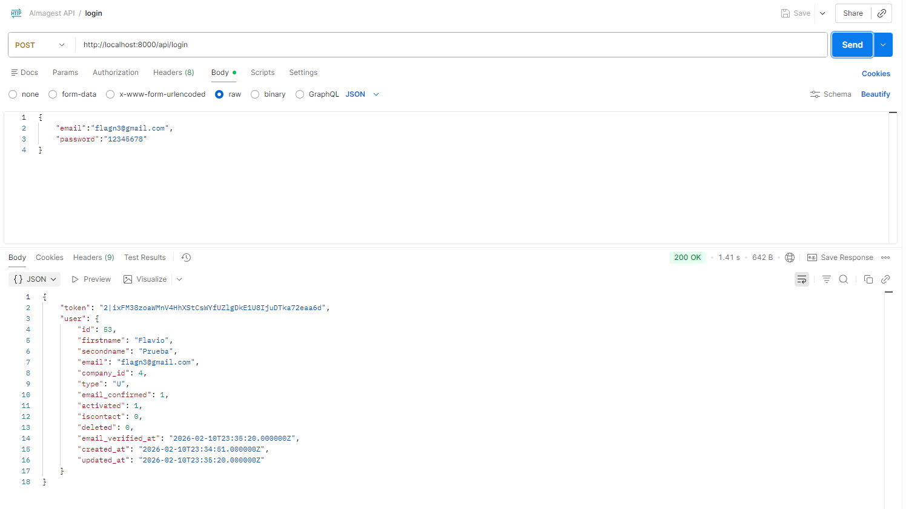
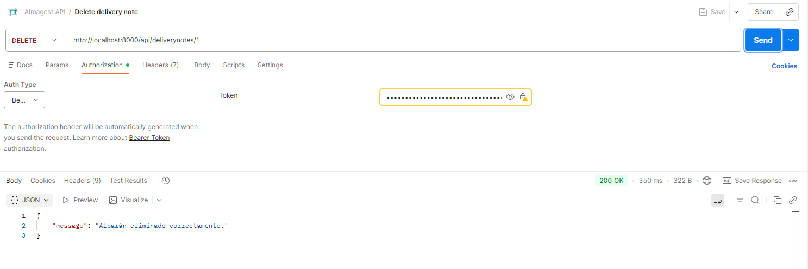
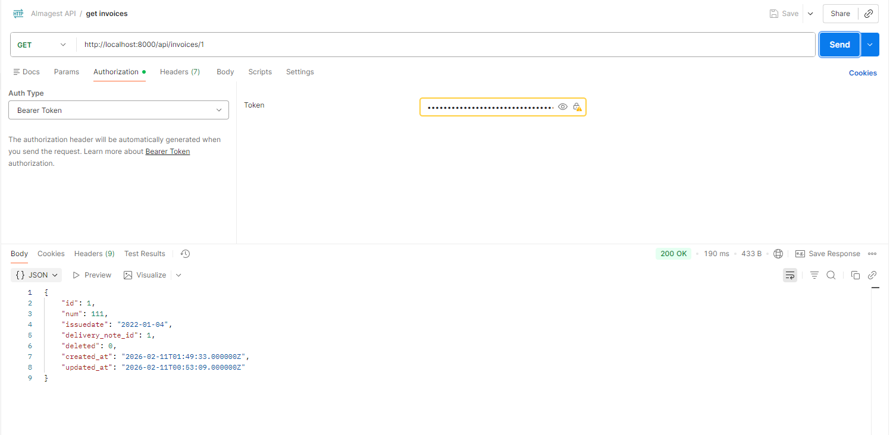
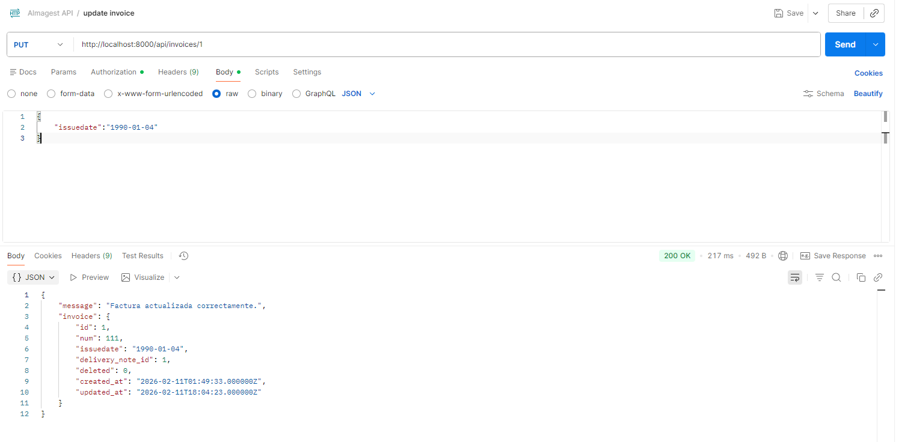
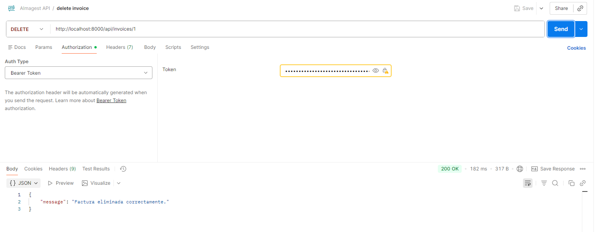
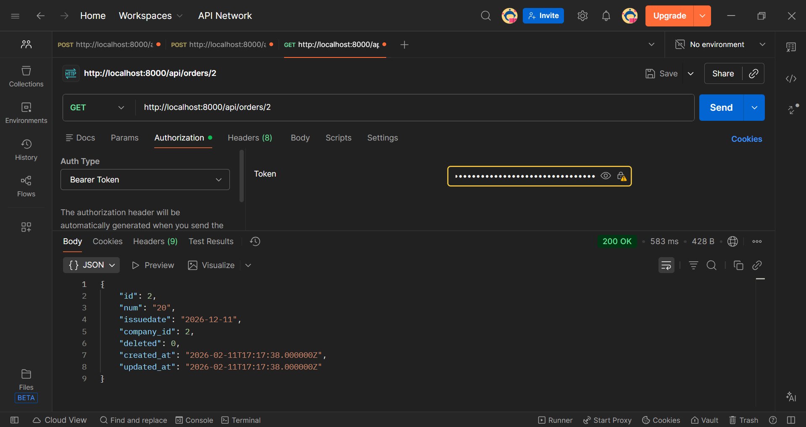
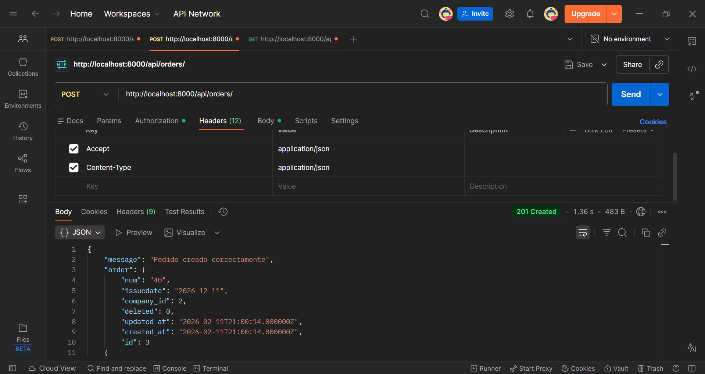

# Almagest API – Manual de Usuario


Almagest es una aplicación **Back-End desarrollada con Laravel** que proporciona una **API RESTful** para la gestión de pedidos, albaranes y facturas de una empresa.  
Además, incluye una **interfaz web básica** que permite visualizar los datos y comprobar que las operaciones de la API se realizan correctamente.

Este manual está orientado a usuarios no experimentados, explicando paso a paso cómo acceder al sistema, usar las vistas y consumir la API mediante **Postman**.

---

## 1. Instalación y ejecución

- Descargar el proyecto en formato zip o clonarlo
- Ejecutar desde la raiz los comandos:
```composer install```
```npm install```
- Iniciar Apache y MySQL utilizando Xampp.
- Arrancar la aplicación mediante ```php artisan serve```.
- Èjecutar el comando ```npm run dev```.

---

## 2. Acceso a la aplicación

### 2.1 Página de inicio

Al acceder a la aplicación se muestra una pantalla de bienvenida con dos opciones:

- **Sign Up**: Registro de usuario
- **Login**: Inicio de sesión

---

### 2.2 Registro de usuario

Para registrarse:
1. Pulsar en **Sign Up**
2. Rellenar el formulario con los datos solicitados
3. Confirmar el registro

Tras el registro, el usuario deberá **verificar su correo electrónico** antes de poder acceder completamente a la aplicación.


---

### 2.3 Inicio de sesión

Para iniciar sesión:
1. Pulsar en **Login**
2. Introducir email y contraseña
3. Confirmar

---

## 3. Roles de usuario

La aplicación dispone de dos tipos de usuario:

### 3.1 Administrador
- Puede acceder al **panel de administración**
- Puede **activar, desactivar, editar o eliminar usuarios**

---

### 3.2 Usuario estándar
- Puede acceder a las vistas de:
  - Albaranes
  - Pedidos
  - Facturas

---

## 4. Vistas disponibles

Desde el menú lateral, el usuario puede acceder a la sección **Albaranes, Pedidos y Facturas**.

En estas vistas se muestran tablas con los albaranes, pedidos y facturas respectivamente.

---

## 5. Uso de la API RESTful

La API permite gestionar los datos de la aplicación mediante peticiones HTTP.  
Para probarla se utiliza el software **Postman**.

---

### 5.1 Autenticación API

Para poder utilizar los endpoints protegidos es necesario autenticarse mediante la API.

#### Registro
- **Endpoint:** `/api/register`
- **Método:** `POST`
- **Descripción:** Registra un nuevo usuario en el sistema.

**Parámetros (Body – JSON):**
- `firstname` (string)
- `secondname` (string)
- `email` (string)
- `password` (string)
- `password_confirmation` (string)
- `company_id` (integer)

**Respuesta:**
- Usuario creado correctamente
- Token de autenticación

---


#### Login

- **Endpoint:** `/api/login`
- **Método:** `POST`
- **Descripción:** Autentica a un usuario y devuelve un token de acceso.

**Parámetros (Body – JSON):**
- `email` (string)
- `password` (string)

**Respuesta:**
- Token de autenticación (`Bearer Token`)




 ⚠️ Todas las peticiones protegidas requieren enviar el token en el header:

 ```
 Authorization: Bearer {token}
 ```


## 5.2 Endpoints de Albaranes (Delivery Notes)

### Eliminar un albarán

- **Endpoint:** `/api/deliverynotes/{id}`
- **Método:** `DELETE`
- **Descripción:** Marca un albarán como eliminado (borrado lógico).

**Parámetros (URL):**
- `id` → ID del albarán

**Respuesta:**
- Mensaje de confirmación



---

## 5.3 Endpoints de Facturas (Invoices)

### Recuperar una factura

- **Endpoint:** `/api/invoices/{id}`
- **Método:** `GET`
- **Descripción:** Recupera la información de una factura concreta.

**Parámetros (URL):**
- `id` → ID de la factura

**Respuesta:**
- Datos de la factura en formato JSON



---

### Actualizar una factura

- **Endpoint:** `/api/invoices/{id}`
- **Método:** `PUT` o `PATCH`
- **Descripción:** Actualiza los datos de una factura existente.

**Parámetros (Body – JSON):**
- Campos de la factura a modificar (fecha, número, etc.)

**Respuesta:**
- Factura actualizada correctamente
- Nuevos datos de la factura en formato JSON



---

### Eliminar una factura

- **Endpoint:** `/api/invoices/{id}`
- **Método:** `DELETE`
- **Descripción:** Elimina una factura del sistema (borrado lógico o físico según implementación).

**Parámetros (URL):**
- `id` → ID de la factura

**Respuesta:**
- Mensaje de confirmación



---


## 5.4 Endpoints de Pedidos (Orders)

### Recuperar un pedido

- **Endpoint:** `/api/orders/{id}`
- **Método:** `GET`
- **Descripción:** Recupera la información de un pedido concreto.

**Parámetros (URL):**
- `id` → ID del pedido

**Respuesta:**
- Datos de el pedido en formato JSON



---

### Crear un pedido

- **Endpoint:** `/api/orders`
- **Método:** `PUT`
- **Descripción:** Actualiza los datos de una factura existente.
- **Headers:** Accept: application/json | Content-Type: application/json

**Parámetros (BODY - JSON):**
- `num` (string)
- `issuedate` (string) YYYY-mm-dd
- `company_id` (integer)

**Respuesta:**
- Pedido creado correctamente
- Datos del pedido en formato JSON



---
